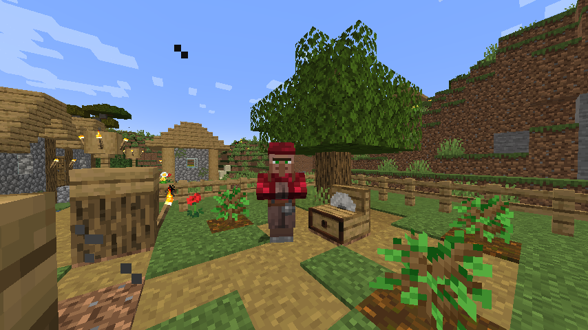
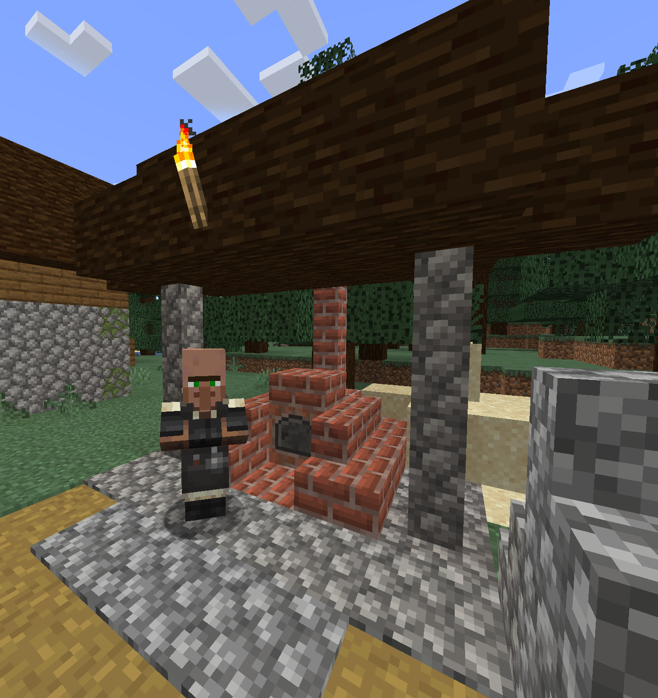
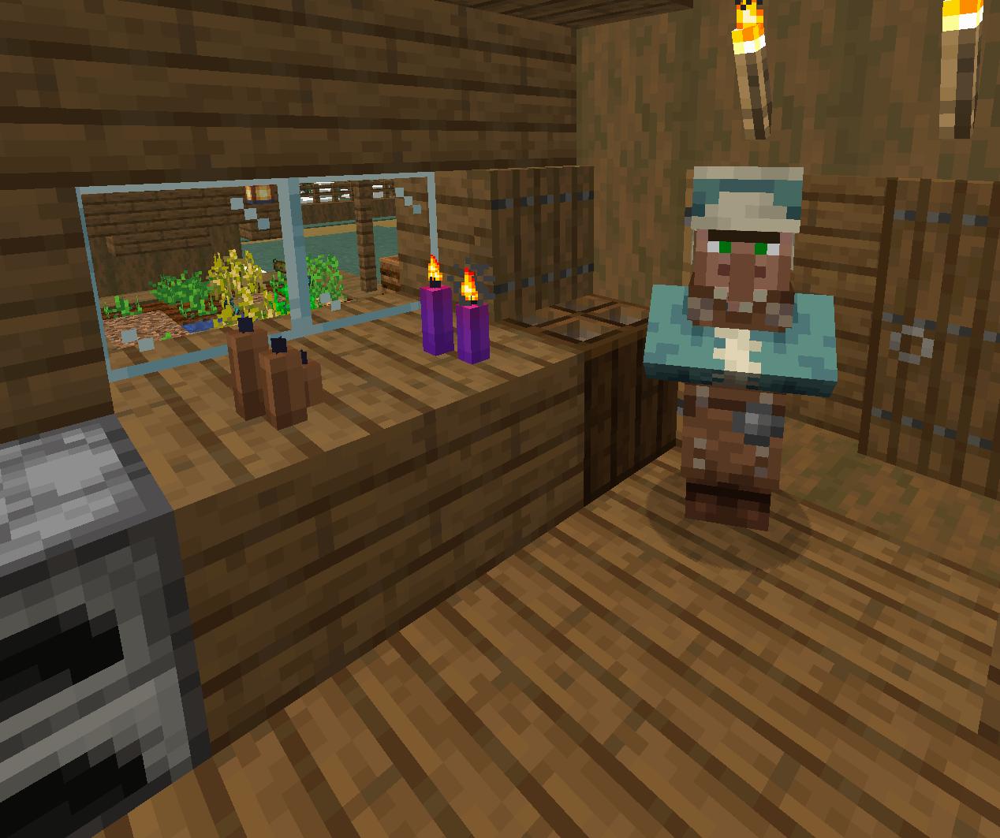
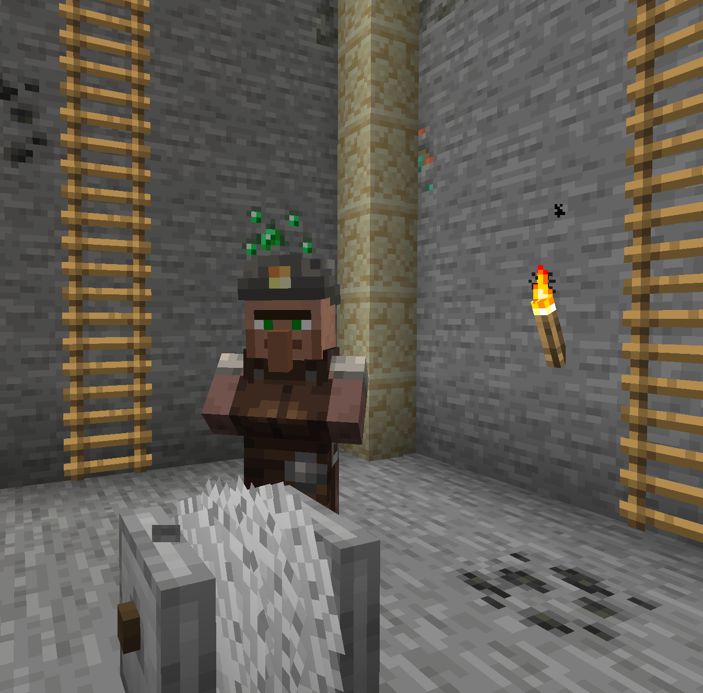

# Extra Professions Mod
Add extra villager professions, including workstations and village buildings. 

## Added Professions
### Lumberjack
The lumberjack manages the new lumber farm buildings, **chopping down trees** and **planting new ones** in their place or on spare **podzol** blocks.  
Their workstation is the **sawmill** block, which also adds a new way of **crafting wood products**, sometimes at a reduced material cost.
They will also trade a variety of wooden products with you, depending on their surroundings.

### Glazier
The glazier is the master of **glass-work**. 
Using their workstation, the **annealer**, they can make glass and other related items at **double the speed** and in some cases **reduced material cost**.  See the annealer recipe book for more.
They will also trade a variety of glass products with you, learning newer and advanced glazing skills as they level up.

### Chandler
The chandler is your friendly local **candle maker**, using their workstation, the **dipping station** they will trade **wax** and **candle** related items with you.   
Even you can use the dipping station to **make candles** of all colors at **reduced material cost**. You can even use new materials for wax (such as blocks and bottles of honey) and wicks (such as sticks).
They also trade a variety of wax, candle and lighting related products with you.  

### Miner
The miner has started an open cut **mine** in the village, with **walls littered with ores**.  
Using the **mining drill**, they can **break ore nearby ores** that are **touching the blades**.  
The miner will also buy and sell the spoils of their mine with you.  

# Downloads
* [Modrinth](https://modrinth.com/mod/extra_professions)
* [Github Releases](https://github.com/aws404/ExtraProfessions/releases)

## Dependencies
* Minecraft: `1.18.x`
* Fabric API: `>=0.46`
* SimpleJsonVillagerTrades: `>=1.2.0` (Bundled, not required to be installed separately)
* Booking It: `*` (Bundled, not required to be installed separately)

## Customisation
You can modify villagers trades through a datapack in the `trade_offers` directory, see [SimpleJsonVillagerTrades](https://github.com/aws404/SimpleJsonVillagerTrades/wiki/Trade-Offer-JSON-Files) for more info.
